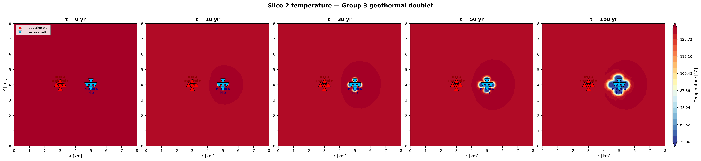
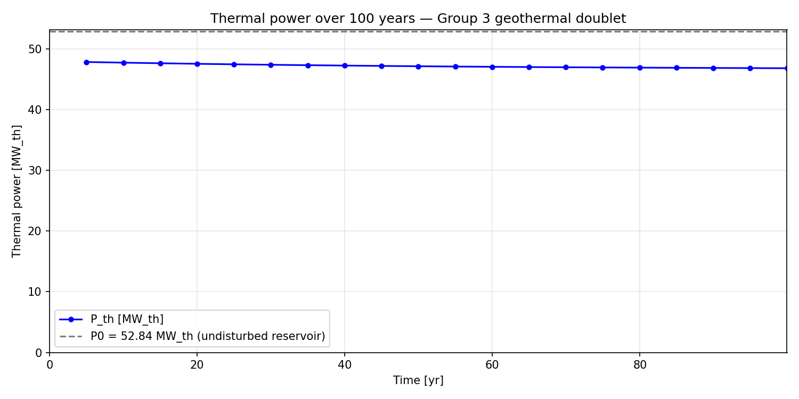
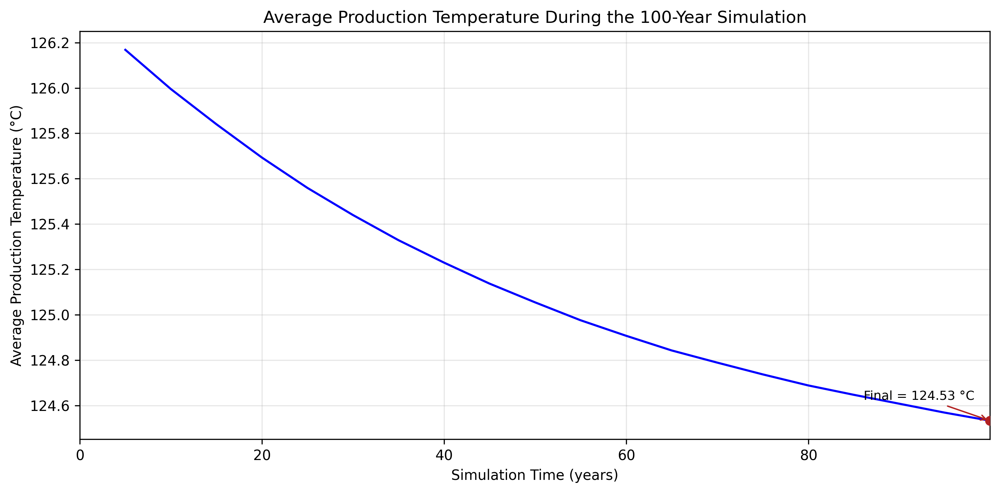
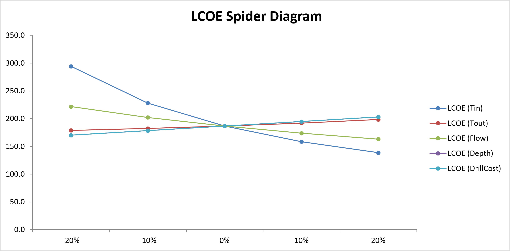

# Group 3 — Geothermal Doublet: FEFLOW → ORC → Economic Assessment

A reproducible, coupled workflow linking a FEFLOW thermo-hydraulic reservoir
simulation to an ORC power-cycle estimate and a techno-economic assessment
(CAPEX, LCOE, sensitivity analysis) for a geothermal doublet.

[](https://www.python.org/)
[](https://www.mikepoweredbydhi.com/products/feflow)
[](https://github.com/imansgh/feflow-geothermal-automation/actions/workflows/python-app.yml)
[](tests/)
[](https://peps.python.org/pep-0008/)
[](LICENSE)

Built for the Erasmus+ Blended Intensive Programme (BIP) *"Geothermal Energy:
Resource Assessment, Plants, and Environmental Impacts"* (2nd edition, 2026),
Politecnico di Torino. The goal is to make every step from raw reservoir data
to a final LCOE number auditable and reproducible, with every simplifying
assumption stated explicitly rather than left implicit.

<p align="center">
  
</p>

<p align="center">
  <em>Figure — Coupled workflow linking the FEFLOW reservoir simulation,
  thermal post-processing, ORC power-cycle performance estimate, and the
  CAPEX / LCOE / sensitivity economic assessment for the Group 3 geothermal
  doublet. Each stage consumes the numerical output of the previous one; no
  intermediate value is re-estimated independently.</em>
</p>

---

## Table of Contents

1. [Overview](#overview)
2. [Features](#features)
3. [Repository Structure](#repository-structure)
4. [Installation](#installation)
5. [Running the Workflow](#running-the-workflow)
6. [Results](#results)
7. [Validation](#validation)
8. [Engineering Assumptions](#engineering-assumptions)
9. [Limitations](#limitations)
10. [Future Work](#future-work)
11. [Reproducibility](#reproducibility)
12. [Scientific Integrity](#scientific-integrity)
13. [Contributing](#contributing)
14. [Citation](#citation)
15. [License](#license)

---

## Overview

This repository automates a **geothermal doublet feasibility workflow**: it
couples a numerical reservoir simulation to a simplified power-cycle model
and a first-order economic assessment, and keeps every intermediate number
traceable back to its source. It exists to demonstrate — for teaching and
research purposes — how these three modelling domains (subsurface,
thermodynamic, economic) can be connected in a single, auditable chain
instead of being computed as three disconnected spreadsheets.

### Workflow

```text
Reservoir characterization
        │
        ▼
FEFLOW simulation
        │
        ▼
Thermal post-processing
        │
        ▼
Average production temperature extraction
        │
        ▼
ORC performance estimation
        │
        ▼
Annual electricity production
        │
        ▼
Economic assessment
        │
        ▼
LCOE
        │
        ▼
Sensitivity analysis
```

The ORC inlet temperature is not assumed or re-estimated independently — it
is extracted from the FEFLOW post-processing output (see
[Average Production Temperature](#average-production-temperature)). This is
what makes the workflow *coupled* rather than a set of independent
calculations sharing only a common topic.

This project is an **educational and research workflow**. It is not intended
for real investment decisions and does not constitute industrial validation
of any of its component models — see [Limitations](#limitations) and
[Scientific Integrity](#scientific-integrity).

---

## Features

- Automated, GUI-free FEFLOW 8.1 workflow (scripted stages, single entry
  point)
- Python post-processing of raw simulation results (no manual chart reading)
- Reservoir temperature evolution over the full 100-year simulation
- Thermal power evolution over the full 100-year simulation
- Average production-temperature extraction from raw FEFLOW node data
- ORC performance estimation (Lorentz-cycle method)
- Monthly-resolved electricity production, cross-checked against the annual
  estimate
- Economic assessment: CAPEX estimation from a documented, referenced
  unit-cost basis
- LCOE calculation, validated against an independent worked example
- Five-parameter sensitivity (spider-diagram) analysis
- Fully reproducible workflow: every number can be regenerated from the
  tracked input files, with no manual or hidden calculation step

---

## Repository Structure

```text
feflow-geothermal-automation/
│
├── assets/
│   └── Workflow.png                        # Hero workflow diagram (this README)
│
├── data/
│   └── geoth_tutorial_data_Group3.xlsx      # Source workbook (well data, slice T)
│
├── scripts/                                 # One module per pipeline stage
│   ├── config.py                            # Central configuration + derived quantities
│   ├── utils.py                             # IFM bootstrap, mesh helpers, logging
│   ├── 01_build_geometry.py                 # Supermesh polygon + well node import
│   ├── 02_generate_mesh.py                  # Triangular mesh (PTS = 5 m, PG = 4)
│   ├── 03_create_slices.py                  # 3D layer configuration
│   ├── 04_problem_settings.py               # Problem class, time control, fluid props
│   ├── 05_material_properties.py            # K, φ, Cᵥ, λ per geological unit
│   ├── 06_initial_conditions.py             # Hydraulic head + geothermal temperature IC
│   ├── 07_boundary_conditions.py            # Border T-BC, heat-flux BC, head BC
│   ├── 08_multilayer_wells.py               # MLW assignment + injection T BC
│   ├── 09_simulation_settings.py            # FE/BE, dt limits, custom output times
│   ├── 10_run_model.py                      # singleStep() loop, NPZ writer
│   ├── 11_postprocess.py                    # Post-processing + figures F1–F8
│   └── 12_extract_avgT.py                   # Exact average production temperature CSV, from raw NPZ
│
├── economics/                                # Energy production & economic assessment
│   ├── README.md                             # Methodology, assumptions, caveats
│   ├── ORC_Group3.xlsx                       # Electrical power (Lorentz-cycle ORC)
│   └── Economic_Assessment_Group3.xlsx       # CAPEX / LCOE / sensitivity spider diagram
│
├── tests/                                    # Licence-free automated test suite
│   ├── conftest.py
│   ├── test_config.py                        # Config loading, temperature cross-check
│   ├── test_utils.py                         # Mesh node count, coordinate helpers
│   ├── test_thermal_power.py                 # NPZ format contract, power calculation
│   └── test_postprocess_new.py               # F6/F7 existence, NPZ fallbacks
│
├── notebooks/                                # Interactive, exploratory analysis
│   ├── 01_explore_results.ipynb
│   ├── 02_breakthrough_analysis.ipynb
│   └── 03_thermal_power.ipynb
│
├── figures/                                  # Publication-quality figures (committed)
│   ├── F1_temperature_maps.png
│   ├── F2_cross_section.png
│   ├── F3_breakthrough_curve.png
│   ├── F4_thermal_power.png
│   ├── F5_head_map.png
│   ├── F6_head_evolution.png
│   ├── F7_timestep_evolution.png
│   ├── F8_average_production_temperature.png
│   ├── F8_average_production_temperature.pdf
│   └── F9_spider_diagram.png                # Exported from the Sensitivity sheet's native chart
│
├── docs/
│   └── VALIDATION.md                         # Independent technical validation summary
│
├── outputs/                                  # Generated by the pipeline (mixed tracking, see below)
│   ├── Group3.fem                            # FEFLOW model, post-simulation state — gitignored
│   ├── Group3.dac                            # FEFLOW binary results archive — gitignored
│   ├── Group3.npz                            # NumPy snapshot archive — gitignored
│   ├── Group3_results.xlsx                   # Human-readable Excel mirror of Group3.npz — tracked
│   ├── thermal_power_table.csv               # Generated by Stage 11 — not currently tracked
│   ├── Average_Production_Temperature.csv    # Exact, raw-data extraction — tracked
│   └── thermal_timeseries.csv                # Same data, alternate file name — tracked
│
├── .github/workflows/python-app.yml          # CI: flake8 + pytest on every push/PR
├── build_group3_model.py                     # Master pipeline script
├── requirements.txt
├── environment.yml
├── CITATION.cff
├── CONTRIBUTING.md                            # Development setup, coding conventions, PR process
├── CHANGELOG.md                               # Dated history of notable changes
├── LICENSE
└── .gitignore
```

Most of `outputs/` is excluded from version control (see `.gitignore`) — the
large FEFLOW binaries (`Group3.fem`, `Group3.dac`, `Group3.npz`) are
regenerated by the pipeline, not committed. `Average_Production_Temperature.csv`,
`thermal_timeseries.csv`, and `Group3_results.xlsx` are the exception: they
are small/derived enough to track directly, so they are committed and
readable without re-running the pipeline. `thermal_power_table.csv` is
produced by Stage 11 on every run but is not currently committed — see
[Reproducibility](#reproducibility).

---

## Installation

**Operating system:** developed and tested on Windows (FEFLOW 8.1's native
platform); the licence-free stages (post-processing, figures, tests) are
platform-independent.

### 1 — Clone the repository

```bash
git clone https://github.com/imansgh/feflow-geothermal-automation.git
cd feflow-geothermal-automation
```

### 2 — Create the Python environment (Python ≥ 3.9)

**With pip:**

```bash
python -m venv .venv
source .venv/bin/activate       # Windows: .venv\Scripts\activate
pip install -r requirements.txt
```

**With conda:**

```bash
conda env create -f environment.yml
conda activate feflow-geothermal
```

Core dependencies: `numpy` (≥ 1.24), `pandas` (≥ 2.0), `openpyxl` (≥ 3.1),
`matplotlib` (≥ 3.7), `pytest` (≥ 7.4, development only).

### 3 — Install FEFLOW 8.1 (required for Stages 1–10 and 12 only)

FEFLOW 8.1 is a commercial product of DHI A/S and is **not** distributed
with, or installable via, this repository. A valid licence provides the
`ifm312.pyd` Python bindings used by the simulation stages. The workflow has
been validated against FEFLOW 8.1 specifically and has **not** been verified
against FEFLOW 7.x.

Expose the bindings either by using FEFLOW's bundled interpreter
(`<FEFLOW_INSTALL>/bin64/python/python.exe`) or by adding its Python
directory to `PYTHONPATH`:

```bash
# Windows (PowerShell)
$env:PYTHONPATH = "C:\Program Files\DHI\2024\FEFLOW 8.1\bin64\python"

# Linux / macOS
export PYTHONPATH="/opt/dhi/feflow81/bin64/python"
```

Stage 11 (post-processing and figures) and the full test suite run **without**
a FEFLOW licence.

---

## Running the Workflow

The pipeline is organised into six practical steps. Steps 1–3 require a
FEFLOW licence (step 3's well→node mapping depends on the FEFLOW IFM, even
though the rest of that stage is plain NumPy); steps 4–6 run from committed
CSV/XLSX files and require no licence.

1. **Prepare the model** — Stages 1–9 build the supermesh geometry, mesh,
   material properties, initial/boundary conditions, and multilayer wells.
   ```bash
   python build_group3_model.py --skip-run
   ```
2. **Run the simulation** — Stage 10 executes the `singleStep()` control
   loop (a workaround for a verified FEFLOW 8.1 IFM regression that prevents
   enumerating multi-snapshot DAC files) and writes `Group3.dac` /
   `Group3.npz`.
   ```bash
   python scripts/10_run_model.py
   ```
3. **Extract the exact average production temperature** — Stage 12 reads the
   raw NPZ node values (no chart reading) and writes
   `outputs/Average_Production_Temperature.csv`.
   ```bash
   python scripts/12_extract_avgT.py
   ```
4. **Run post-processing and generate figures** — Stage 11 computes the
   thermal breakthrough curve and thermal power, and produces all eight
   figures (F1–F8) in a single run. It is one script, not two, because the
   post-processing calculations and the plotting live in the same module.
   ```bash
   python scripts/11_postprocess.py
   ```
5. **Run the ORC analysis** — `economics/ORC_Group3.xlsx` estimates net
   electrical power and annual/monthly electricity production, using the
   production temperature from step 3 as `Tsource-in`.
6. **Run the economic assessment** — `economics/Economic_Assessment_Group3.xlsx`
   computes CAPEX, LCOE, and the five-parameter sensitivity analysis.

```bash
# Full automated run of steps 1-2 and 4 (~5-15 min with a FEFLOW licence)
python build_group3_model.py

# Licence-free test suite
pytest tests/ -v
```

> **Run-order note.** `build_group3_model.py` currently orchestrates Stages
> 1–11 only; Stage 12 (step 3 above) is run separately. Figure F8 (step 4) is
> read from `outputs/Average_Production_Temperature.csv`, so **Stage 12
> should be run before Stage 11** on a clean checkout — otherwise Stage 11
> will raise a file-not-found error at the F8 step. This ordering constraint
> is stated here for transparency; it does not affect the validity of any
> committed result, since all figures and CSVs in this repository were
> already generated in the correct order.

---

## Results

### Numerical Model

<p align="center">
  
</p>

<p align="center">
  <em>Figure F1 — Plan-view of the simulation domain at Slice 2, generated by
  `tricontourf` on the actual FEFLOW mesh (Delaunay triangulation), with
  production/injection well positions overlaid, at five simulation times.
  The repository does not include a separate mesh-only geometry figure; the
  t = 0 panel is the closest representation of the initial model
  configuration.</em>
</p>

### Thermal Results

<p align="center">
  
</p>

<p align="center">
  <em>Figure F4 — Thermal power (P_th) evolution over the 100-year
  simulation. Power declines from the undisturbed-reservoir reference value
  as the injected cold-water plume progressively reaches the production
  wells (thermal breakthrough), a well-known behaviour of doublet
  geothermal systems operated at constant flow rate.</em>
</p>

### Average Production Temperature

<p align="center">
  
</p>

<p align="center">
  <em>Figure F8 — Average production-well temperature over the 100-year
  simulation, extracted directly from the raw FEFLOW node values (Stage 12),
  not read from a chart.</em>
</p>

The ORC inlet temperature was directly extracted from the FEFLOW
post-processing output. The exact, NPZ-derived value at t = 100 yr is
**124.53 °C**, and the ORC workbook now uses this exact value (updated from
an earlier, chart-based estimate of 125 °C, a 0.47 °C correction); see
[Engineering Assumptions](#engineering-assumptions).

### Economic Assessment

CAPEX and LCOE are computed in
[`economics/Economic_Assessment_Group3.xlsx`](economics/Economic_Assessment_Group3.xlsx)
(`CAPEX_Group3`, `LCOE_Group3` sheets) from the net electrical power supplied
by the ORC workbook. See [Key Results](#key-results) below for the headline
figures.

### Sensitivity Analysis

<p align="center">
  
</p>

<p align="center">
  <em>Spider diagram illustrating the sensitivity of LCOE to the five principal economic assumptions.</em>
</p>

Figure F9 — exported from the `Sensitivity` sheet's native chart in
`economics/Economic_Assessment_Group3.xlsx`. It varies `T_source-in`,
`T_source-out`, flow rate, well depth, and drilling cost per metre by
±10%/±20% around the base case. All five lines cross at the common
base-case LCOE (186.5 €/MWh) by construction — the base-case cell in each
column references the workbook's own `LCOE_Group3` sheet directly — which is
also the expected behaviour of a correctly constructed spider chart and is
treated as a validation check (see [Validation](#validation)). Drilling cost
per metre and production temperature are the parameters with the largest
influence on LCOE for this plant configuration. The well-depth and
drilling-cost lines are exactly coincident (not a rendering artefact): in
this formulation, CAPEX depends only on the *product* of well depth and
drilling cost per metre, so scaling either input by the same percentage
produces an identical LCOE — the "LCOE (Depth)" line is fully hidden behind
"LCOE (DrillCost)" in the figure above.

---

### Key Results

| Quantity | Value |
|----------|-------|
| Reservoir temperature (initial) | 134.1 °C |
| Average production temperature (t = 100 yr) | 124.53 °C |
| Injection temperature | 50.0 °C |
| Thermal power (t = 0 → t = 100 yr) | 52.8 → 46.8 MW_th (~11% degradation) |
| Net electrical power (ORC) | ~4.22 MW net electrical |
| Annual electricity production | ~33.8 GWh/yr |
| CAPEX | ≈ €51.9 M |
| Specific CAPEX | ≈ €12,294/kW net |
| LCOE | 186.5 €/MWh |

All values above are reproduced exactly from the underlying CSVs and
workbooks (see [Reproducibility](#reproducibility)); none have been rounded
beyond what is shown in the source files.

---

## Validation

The following elements have been independently verified or reproduced by a
second method, with the check itself kept in the repository (a config-level
assertion, a unit test, or a second worked example) rather than only
asserted in prose:

- **Reservoir properties** — read once from the source workbook into
  `scripts/config.py`; no value is retyped by hand downstream.
- **Permeability** — hydraulic conductivity *K* is derived analytically from
  intrinsic permeability *k* and cross-checked against the workbook's own
  `conductivities` sheet; the two agree to within ~0.4%.
- **Temperature profile** — initial temperatures are computed analytically
  from Fourier's law and cross-checked against the workbook's `sliceT`
  sheet at load time; a warning is raised if any slice deviates by more
  than 0.05 °C.
- **Thermal power** — computed analytically from well flow rate and
  temperature difference, covered by a dedicated unit test that checks the
  NPZ data contract and the power formula independently of any single
  FEFLOW run.
- **ORC annual production** — the annual estimate and the monthly-resolved
  estimate are two independent calculation paths through the same ORC
  spreadsheet; they agree within 0.02%.
- **CAPEX consistency** — the CAPEX breakdown is benchmarked against the
  €/kW figure implied by the reference plant it is scaled from.
- **LCOE equations** — the LCOE formula and capital-recovery factor were
  validated by first reproducing an independent worked example (156.4
  €/MWh, Xodo's own reference case) with the identical method, before being
  applied to this plant.

These consistency checks were performed across the complete workflow — from
the reservoir input data to the final LCOE — not only within isolated
modules. They establish internal consistency and correct implementation of
the chosen methods; they do not, by themselves, establish that the
underlying simplified methods are an accurate representation of a real
geothermal plant — see [Limitations](#limitations).

---

## Engineering Assumptions

| Assumption | Reason |
|------------|--------|
| Constant flow rate (150 L/s production, 150 L/s injection) over 100 years | Educational simplification; no operational flow-control strategy is modelled |
| Spreadsheet-based ORC model (Lorentz-cycle method) rather than a full process simulation | Course requirement; matches the intended scope of the assignment |
| Linear drilling-cost scaling with depth | Literature-based assumption, taken from a single reference example (see [Limitations](#limitations)) |
| Constant, spatially uniform reservoir (rock) properties per geological layer | Consistent with the assignment's geological dataset |
| ORC inlet temperature sourced from FEFLOW post-processing | Couples the subsurface simulation directly to the surface energy-conversion model |
| Capacity factor of 95% (8,322 h/yr) | Adopted from the reference example used for unit costs |
| No stochastic or probabilistic treatment of any input parameter | Deterministic, single-scenario analysis; sensitivity explored only via the ±10%/±20% spider diagram |

---

## Limitations

- Drilling costs are linearly scaled from a single literature reference (a
  2,500 m, >250 °C well) and applied to Group 3's much shallower 1,120 m
  wells. In reality, drilling cost is generally non-linear with depth.
- The ORC model is spreadsheet-based (Lorentz-cycle method); it is not a
  full industrial process model. No detailed heat-exchanger sizing,
  working-fluid selection study, part-load behaviour, or secondary-equipment
  losses are captured.
- The economic model does not include:
  - Taxes
  - Inflation
  - Escalation
  - Component replacement
  - Well workovers
  - Electricity-price uncertainty
  - Carbon credits
- The reservoir model does not include:
  - Fracture networks
  - Thermo-hydro-mechanical (THM) coupling
  - Reactive transport
  - Parameter uncertainty
  - Highly heterogeneous geology

The reported results should therefore be interpreted as a preliminary
techno-economic assessment intended for educational and research purposes
rather than as a bankable feasibility study.

---

## Future Work

- Monte Carlo uncertainty analysis of economic and reservoir parameters
- Detailed ORC modelling in Aspen Plus / Aspen HYSYS
- Dynamic (time-varying) electricity prices
- Carbon credit / avoided-emissions analysis
- Real, vendor-sourced drilling-cost databases
- Coupled thermo-hydro-mechanical (THM) simulations
- Fractured-reservoir models
- Economic optimization studies (e.g., well count, spacing, flow rate)
- Multi-group automation: `build_group3_model.py` already accepts a
  `--group N` flag as a placeholder, but the group-switching logic itself is
  not yet implemented

---

## Reproducibility

Every result in this repository can be regenerated with no manual
calculation or hidden intermediate step, from the inputs below:

- **FEFLOW model** — `data/geoth_tutorial_data_Group3.xlsx` (source
  workbook, tracked). The mesh template (`Group3_template.fem`) is built
  once in the FEFLOW GUI and is intentionally gitignored (it is a large,
  machine-specific binary); rebuilding it is the one manual, GUI-based step
  in an otherwise scripted pipeline and is required before Stage 1 can run
  on a fresh checkout.
- **Python scripts** — `scripts/01_build_geometry.py` through
  `scripts/12_extract_avgT.py`, orchestrated by `build_group3_model.py`.
- **CSV outputs** — `outputs/Average_Production_Temperature.csv` and
  `outputs/thermal_timeseries.csv` are committed. `outputs/thermal_power_table.csv`
  is generated fresh by Stage 11 on every run but is not currently committed.
- **ORC workbook** — `economics/ORC_Group3.xlsx`.
- **Economic workbook** — `economics/Economic_Assessment_Group3.xlsx`.
- **Figures** — `figures/F1_temperature_maps.png` through
  `figures/F8_average_production_temperature.png` / `.pdf`, all generated by
  `scripts/11_postprocess.py`; `figures/F9_spider_diagram.png` is exported
  directly from the `Sensitivity` sheet's native chart in
  `economics/Economic_Assessment_Group3.xlsx`, not from the Python pipeline.

No stochastic elements are present anywhere in the pipeline; the only source
of numerical non-reproducibility is the FEFLOW solver's internal tolerance
for adaptive time-step acceptance.

---

## Scientific Integrity

Engineering assumptions are explicitly documented (see
[Engineering Assumptions](#engineering-assumptions) and
[Limitations](#limitations)), and their influence on the final LCOE is
quantified through the five-parameter sensitivity analysis described in
[Results](#results). No attempt has been made to overstate the accuracy of
the economic assessment, and none of the results presented here should be
read as evidence of industrial validation. This repository prioritises
transparency and reproducibility over polish: every figure, table, and
number can be traced back to a specific script or workbook (see
[Reproducibility](#reproducibility)).

---

## Contributing

Contributions that improve reproducibility, documentation accuracy, or test
coverage are welcome. See [`CONTRIBUTING.md`](CONTRIBUTING.md) for the
development setup, coding conventions, test requirements, and pull-request
process. A record of past changes is kept in [`CHANGELOG.md`](CHANGELOG.md).

---

## Citation

If this repository is used in academic work, please cite both this
repository (see [`CITATION.cff`](CITATION.cff)) and the original educational
material it builds on:

- A. Casasso, *FEFLOW Geothermal Energy Tutorial* (rev00, 03/06/2024),
  Politecnico di Torino — source of the ORC workbook template
  (`GeothermalORCturbines_Casasso.xlsx`).
- L. Xodo, *Geothermal Power Plant General Design and Business Plan*, STEAM
  Srl — source of the drilling and plant unit-cost assumptions.

---

## License

Released under the **MIT License** — see [`LICENSE`](LICENSE) for the full
text, also declared in [`CITATION.cff`](CITATION.cff).

FEFLOW is a commercial product of DHI A/S. This repository contains no
FEFLOW source code or proprietary binaries. A valid FEFLOW licence is
required to execute Stages 1–10 and Stage 12.

---

## Acknowledgements

Developed as the Group 3 feasibility study and well-field simulation for the
Erasmus+ BIP *"Geothermal Energy: Resource Assessment, Plants, and
Environmental Impacts"* (2nd edition, 2026), Politecnico di Torino.

**Group 3 members:** Iman Saghafi Far, Alessandro De Muro (Politecnico di
Torino); Ana Carolina Marques Moreira, Sofia Isabel Casquerio Rodrigues
(University of Lisbon); Anton Afanasiev (University of Patras); Myrsini
Ntente (KTH Royal Institute of Technology).

The automation pipeline and this documentation were developed by Iman
Saghafi Far. The geological dataset, conceptual model, and feasibility
analysis were a collaborative effort of the full Group 3 team. With thanks
to Alessandro Casasso (Politecnico di Torino) for the FEFLOW Geothermal
Energy Tutorial on which this work is based.

---

*Developed for the Erasmus+ BIP "Geothermal Energy: Resource Assessment,
Plants, and Environmental Impacts" (2nd ed., 2026), Politecnico di Torino.
FEFLOW 8.1 by DHI A/S.*
